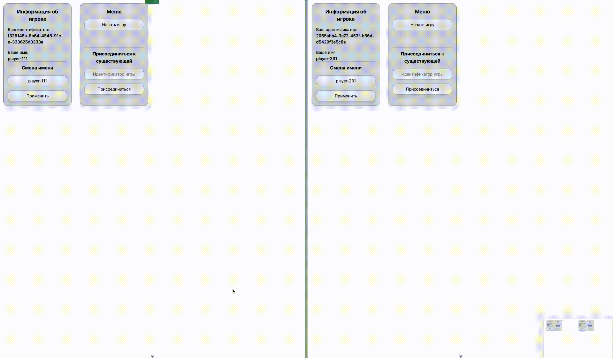

# Snake PvP

Многопользовательская ретро змейка. Максимум 4 игрока на комнату. Есть возможность подключения по uuid комнаты

## Попробовать: https://snake-pvp-production.up.railway.app/

## Demo


## Стек

- **Backend:** Go, Gin, Centrifuge (WebSocket)
- **Frontend:** Vue 3, Tailwind CSS v4

## Как это работает

### Главный экран
При первом входе на страницу генерируется uuid и имя пользователя. Uuid является идентификатором пользователя. Имя пользователя можно сменить на этом же экране. Они оба хранятся в localstorage браузера

### Игра
Примерно 7 раз в секунду происходит обработка тика. Во время тика проверяется направление каждой змейки, следующую от неё клетку и последствия перехода передвижение/рост/смерть

Размер игрового поля 50x50 пикселей. Границ нету, то есть из одной стороны можно перейти в другую.

Если змейки 2+, то победа происходит когда в живых останется только 1 змейка. В случае соло игры только после смерти отображается конец

### Управление
PC - Стрелочки

Mobile - Свайпы по игровому полю

## Запуск локально

```bash
docker compose up
```

Фронтенд: http://localhost:5173, бэкенд: http://localhost:8080

## Production-сборка

Фронтенд собирается и встраивается в Go-бинарник через `//go:embed`. На выходе — один исполняемый файл.

```bash
docker build -f docker/Dockerfile.prod -t snake .
docker run -p 8080:8080 snake
```
